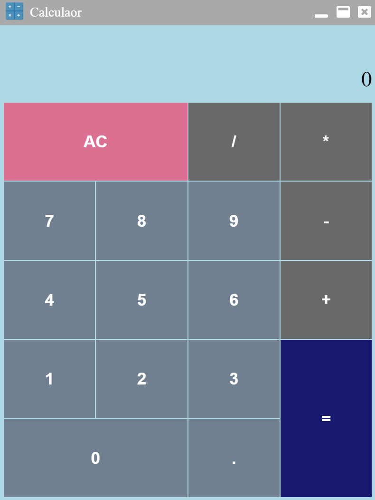

# electron-calculator
A calculator exercise for testing modern tools
- - -

## Project Preview

- - -

## This project is currently built on
* [Electron](https://www.electronjs.org/)
* [ReactJS](https://reactjs.org/)
* [TypeScript](https://www.typescriptlang.org/)
* [Webpack](https://webpack.js.org/)
* [electron-builder](https://www.electron.build/)
- - -

## Features of the project
* It supports following operands and actions:
  * (+) Add
  * (-) Subtract
  * (x) Multiply
  * (/) Divide
  * (=) Equal
  * (AC) clear
* It can deal with numbers betwwen **Number.MIN_SAFE_INTERGER** and **Number.MAX_SAFE_INTEGER**
* It supports keyboard shortcuts:
  * c - clear
  * Esc - Exit the program
* You can conduct following actions to the program window:
  * Minimize the window
  * Maximize the window
  * Unmaximize the window
  * Close the window
* It has custom titlebar and application icon.
- - -

## Project Usage Guide
Install dependency

`npm install`

Run the program in development mode with auto refresh when code modified

`npm run dev`

Build packed program

`npm run pack`

Build distribution file

`npm run dist`
- - -

## Project Directory Explanation
    /src         - root directory of source code
    /src/@types  - custom type definition file
    /src/app     - renderer process source code
    /src/preload - preload file source code
    /build       - build file placement
    /dist        - packed and distribution file placement
    /assets      - static resource placement
- - -

##  Todo List
* Add Jest for unit testing
